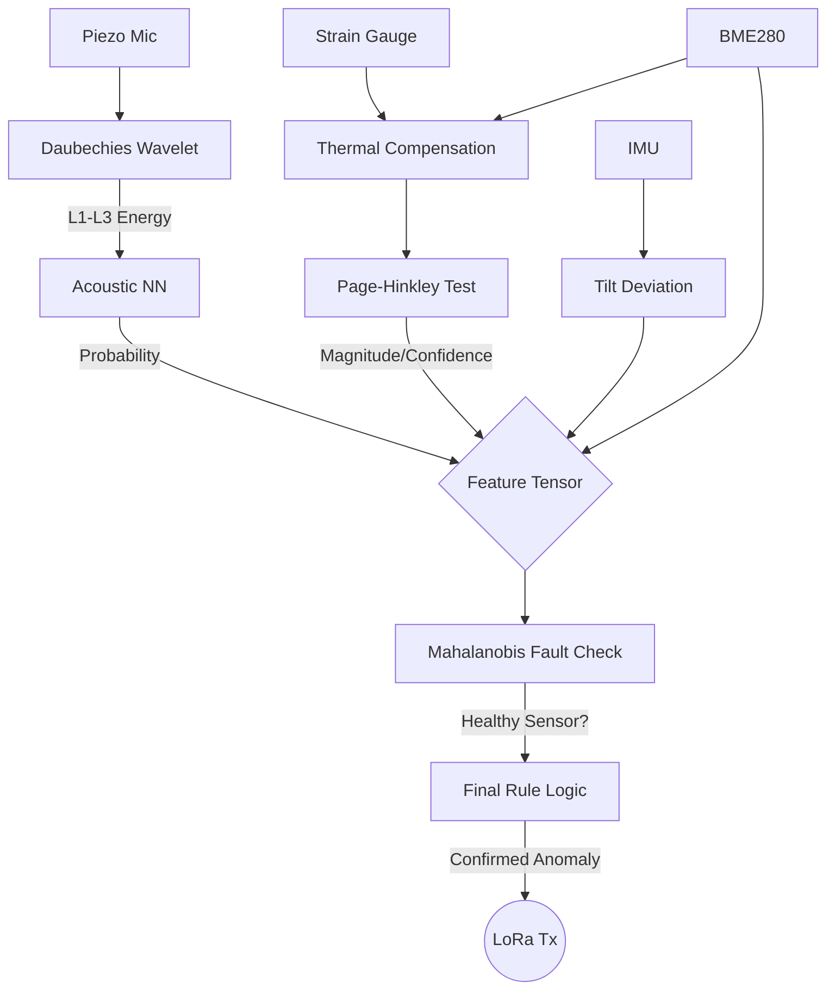
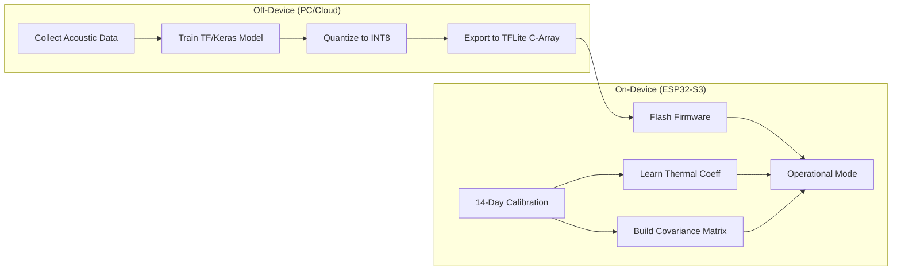

# 04 - TinyML Integration & On-Device Processing Architecture

This document details the Machine Learning (TinyML) architecture and integration strategy for the ATF V-2.1 Edge-Processed Structural Health Monitoring (SHM) Node. It outlines how models and algorithms are deployed on the ESP32-S3 microcontroller to achieve real-time, event-driven anomaly detection within strict power and memory constraints.

---

## 1. TinyML Architecture Overview

In the context of the ATF V-2.1 SHM Node, **TinyML** refers to the deployment of machine learning inference and advanced digital signal processing (DSP) directly on the edge microcontroller (ESP32-S3) under severe memory and compute constraints. 

The core inference runtime utilized is **TensorFlow Lite for Microcontrollers (TFLite Micro)**, taking advantage of the ESP32-S3's dual-core architecture and vector instructions for optimized performance.

**Crucial Design Paradigm:** The TinyML architecture is **NOT** a single monolithic neural network. Instead, it is an orchestrated, event-driven pipeline of specialized classical DSP algorithms, statistical methods, and lightweight neural networks. This hybrid approach guarantees determinism, maximizes interpretability, and minimizes active computation time (thus preserving battery life).

---

## 2. The Four TinyML Components

The intelligent processing pipeline consists of four distinct components. Each handles a specific subsystem's data and translates raw signals into high-level state classifications.

### 2.1 Calibration Learner (Thermal Regression Model)
*   **Type:** Classical regression statistics (On-device calculation, NOT a Neural Network).
*   **Subsystem Connection:** Environmental Compensation (Subsystem 4).
*   **Input Features:** Paired environmental samples [BME280 Temperature, HX711 Raw Strain] collected over a 14-day autonomous calibration phase.
*   **Processing Mechanism:** Fits a linear or polynomial regression model incrementally on-device to isolate the structure-specific thermal-expansion coefficient.
*   **Output:** Learned thermal coefficient(s) for the specific bridge segment.
*   **Memory Footprint:** Minimal (< 1 KB) — stores only the resulting coefficients and running statistical accumulators.
*   **Execution Profile:** Runs passively during the 14-day calibration phase on Core 0. Post-calibration, the learned coefficient is applied passively via simple arithmetic subtraction.

### 2.2 Acoustic Profiler (Wavelet + Audio Classifier)
*   **Type:** HYBRID — Classical DSP (Daubechies Wavelets) + Neural Network Classifier.
*   **Subsystem Connection:** Acoustic Emission (Subsystem 1).
*   **Input Features:** Raw piezo ADC buffer captured instantly upon interrupt wake (e.g., 1024 samples sampled at 20-100 kHz).
*   **Processing Mechanism:** 
    1. **DSP Stage:** Executes a Daubechies wavelet decomposition to extract energy signatures in fast detail coefficient levels (L1-L3). These represent transient, high-frequency bursts typical of micro-fractures.
    2. **ML Stage:** A small dense neural network (e.g., 3-layer: 64-32-2 neurons) evaluates the wavelet feature vector.
*   **Quantization:** Fully INT8 quantized for native execution on ESP32-S3 vector units.
*   **Output:** Fracture Probability Score [0.0 - 1.0] + Precise temporal snap timestamp.
*   **Memory Footprint:** ~10-30 KB for TFLite model weights.
*   **Execution Profile:** Runs on Core 1 *only* during an event-triggered wake.

### 2.3 Causal Time-Judge (Changepoint + Time-Series Analyzer)
*   **Type:** HYBRID — Classical Statistics (Page-Hinkley) + Rule-Based/Small ML Classifier.
*   **Subsystem Connection:** Strain & Deformation (Subsystem 2).
*   **Input Features:** Thermally-compensated strain readings tracked over a specific post-event window (e.g., 5-10 seconds at 10-80 SPS) triggered by the Acoustic Profiler.
*   **Processing Mechanism:**
    1. The Page-Hinkley test accumulates statistical evidence of a regime shift (a permanent baseline change, not just elastic vibration).
    2. A secondary causal scorer (small decision tree or rule-engine) evaluates the shift magnitude, time-to-shift, and confidence score to rule out transient noise.
*   **Output:** Binary classification (Permanent Shift Confirmed / Not Confirmed) + Confidence Score.
*   **Memory Footprint:** Minimal (< 5 KB), predominantly runtime buffer variables.
*   **Execution Profile:** Runs on Core 1 immediately following a positive acoustic classification.

### 2.4 Fault Discriminator (Mahalanobis-Based Multivariate Anomaly Detector)
*   **Type:** Classical Statistical Method (NOT a Neural Network).
*   **Subsystem Connection:** Sensor-Fault Discrimination (Subsystem 5).
*   **Input Features:** A consolidated multivariate point `[acoustic_energy, strain_value, tilt_angle, temperature]`.
*   **Processing Mechanism:** Computes the Mahalanobis distance from a continuously updated covariance matrix representing the "normal" joint behavior of all sensors. 
    *   *High Distance + No Physical Trigger = Sensor Degraded / Faulty.*
    *   *High Distance + Physical Trigger = Structural Anomaly Confirmed.*
*   **Output:** Sensor health status (Healthy / Degraded / Faulty) + Suspect channel identifier.
*   **Memory Footprint:** < 1 KB (Stores a 4x4 covariance matrix and mean vector of floats).
*   **Execution Profile:** Acts as the final gatekeeper on Core 1 before any LoRa transmission is authorized.

---

## 3. Execution Topology: ML vs. Classical DSP

The following table summarizes the processing framework for each intelligence module within the ESP32-S3 architecture.

| Component | Type | Runs On | Framework | Model Size | When Active |
|-----------|------|---------|-----------|------------|-------------|
| Wavelet Transform | Classical DSP | Core 1 | Custom C / ESP-DSP | N/A (algorithm) | Event-triggered |
| Acoustic Classifier | Neural Network | Core 1 | TFLite Micro | ~10-30 KB | Event-triggered |
| Page-Hinkley Test | Classical Statistics | Core 1 | Custom C | N/A (algorithm) | Post-acoustic-event window |
| Causal Scorer | Rule-based / Small NN | Core 1 | Custom C / TFLite | ~5 KB | Post-changepoint |
| Thermal Regression | Classical Statistics | Core 0 | Custom C | N/A (coefficients) | Calibration phase + passive |
| Mahalanobis Distance| Classical Statistics | Core 1 | Custom C | N/A (cov. matrix) | Pre-alert gate |

---

## 4. ML Tensor Construction & Data Flow

Before a final alert is issued, individual subsystem outputs are assembled into a comprehensive feature tensor. This prevents false positives by ensuring the event makes logical, physical sense across all modalities.

**The Decision Tensor:**
`[wavelet_energy_L1, wavelet_energy_L2, wavelet_energy_L3, acoustic_class_probability, strain_changepoint_magnitude, strain_changepoint_confidence, compensated_strain_value, tilt_deviation, mahalanobis_distance, temperature]`

---

## 5. Memory Budget on ESP32-S3

The ESP32-S3 provides 512 KB of internal SRAM and typically 8 MB of PSRAM. Careful memory allocation ensures no heap fragmentation during burst events.

*   **SRAM Allocation (Critical Path):**
    *   TFLite Micro Runtime (Tensor Arena): `~50-100 KB`
    *   Acoustic Classifier Weights: `~10-30 KB`
    *   Wavelet Buffer (1024 float32 samples): `~4 KB`
    *   Strain Buffer (800 samples at 80 SPS x 10s): `~3.2 KB`
    *   Covariance Matrix & Stats: `~1 KB`
    *   FreeRTOS Task Stacks (4 tasks x 8 KB): `~32 KB`
*   **Total SRAM Footprint:** `~150-200 KB` (Leaves >300 KB for networking and system overhead).
*   **PSRAM Utilization:** Reserved exclusively for non-critical historical data logging and deep-buffer storage during the 14-day thermal calibration.

---

## 6. Training Pipeline (Off-Device vs. On-Device)

Training is bifurcated into Off-Device (cloud/desktop) for neural networks, and On-Device for environment-specific statistical models.

**Off-Device Pipeline (Acoustic Neural Network):**
1.  Collect audio data of concrete fractures and typical highway noise.
2.  Train models using Python (TensorFlow/Keras).
3.  Quantize to INT8 to remove floating-point overhead.
4.  Convert to `.tflite` format and generate a C-byte array using `xxd`.
5.  Flash to the ESP32-S3 firmware.

**On-Device Pipeline (Calibration & Mahalanobis):**
The Thermal Regression and Sensor Covariance Matrix are entirely unsupervised and untrained at the factory. They learn their parameters strictly on-device during the initial 14-day calibration phase to adapt perfectly to the specific bridge structure.

---

## 7. On-Device Inference Pipeline (Step-by-Step)

The following sequence dictates the exact operations that occur when a physical structural event happens.

1.  **Hardware Interrupt:** The Piezo comparator detects a signal above the hardware threshold and fires an interrupt.
2.  **Capture:** The ISR instantly captures the ADC buffer (1024 samples).
3.  **Wake Core 1:** Core 1 transitions from deep sleep to active execution.
4.  **DSP Processing:** Core 1 runs the Daubechies wavelet decomposition on the buffer.
5.  **ML Inference:** Extracted wavelet features are passed to the INT8 Acoustic Classifier.
6.  **Causal Trigger:** If the classifier output indicates a high probability of 'fracture', it forces the strain subsystem to open an active monitoring window.
7.  **Time-Series Analysis:** Thermally-compensated strain readings are fed into the Page-Hinkley test over the next 5-10 seconds.
8.  **Fault Gate:** The combined sensor state vector is checked against the Mahalanobis distance model to ensure the event isn't a single-sensor hardware fault.
9.  **Transmission:** If the changepoint is confirmed, causality is established, and sensors are healthy, a structured alert is pushed to the LoRa task for transmission. If any check fails, the event is logged as noise/elastic and the system returns to sleep.

```mermaid
sequenceDiagram
    participant P as Piezo/Comparator
    participant C1 as Core 1 (DSP/ML)
    participant SG as Strain Gauge
    participant MD as Fault Discriminator
    participant L as LoRa Radio

    P->>C1: Interrupt! (Hardware Wake)
    activate C1
    C1->>C1: Run Daubechies Wavelet
    C1->>C1: TFLite Acoustic Classification
    alt Probability > Threshold
        C1->>SG: Open Strain Window (10s)
        activate SG
        SG-->>C1: Stream Strain Data
        deactivate SG
        C1->>C1: Apply Thermal Comp & Page-Hinkley
        alt Changepoint Confirmed
            C1->>MD: Check Sensor Covariance
            alt Sensors Healthy
                C1->>L: Tx Confirmed Anomaly!
            else Sensor Fault Detected
                C1->>L: Tx Maintenance Alert
            end
        end
    end
    deactivate C1
```

---

## 8. Phase 2 TinyML Enhancements (Future Stretch Goals)

The following modules represent future capabilities (Phase 2) and are **not** part of the core V-2.1 prototype scope:

*   **Physics-Informed Residual Modeling ("Digital Twin"):** Incorporates a lightweight mathematical model of beam deflection. The MCU predicts expected strain for a given load, compares it to the observed strain, and uses the residual as a primary feature in the final tensor.
*   **Dempster-Shafer Evidence Fusion:** Replaces the current boolean/rule-based final decision tree with formal evidence-combination rules. Subsystems will output belief mass functions (handling conflict and uncertainty) rather than rigid probabilities, allowing for mathematically robust multi-modal fusion.

---

## 9. Key Design Insight: Why Not One Big Neural Network?

It may seem simpler to feed all raw sensor data (mic, strain, tilt, temp) into a single large Recurrent Neural Network (RNN) or Convolutional Neural Network (CNN). The V-2.1 architecture explicitly avoids this for several critical reasons:

1.  **Interpretability & Auditing:** Civil engineers require physical explanations for bridge alarms. A monolithic NN acts as a "black box." Our separated architecture allows an alert to be annotated with exact physical rationales (e.g., "Acoustic snap detected, followed by a 15µε permanent shift, sensors nominal").
2.  **Memory Constraints:** A multimodal RNN capable of handling high-frequency acoustic data alongside slow-moving strain data would easily exceed the 512 KB SRAM budget and require excessive execution time.
3.  **Causal-Temporal Logic:** The required logic is strictly causal (event A *must* precede permanent shift B). Feedforward ML models struggle to inherently enforce causality without massive parameter counts.
4.  **Mathematical Optimality:** Classical algorithms like Daubechies wavelets and Page-Hinkley changepoint tests are mathematically provable and computationally optimal for their specific sub-domains.
5.  **Patent Defensibility:** A novel orchestration of deterministic DSP and constrained ML on a dual-core edge device provides a much stronger foundation for intellectual property claims than an off-the-shelf monolithic neural network.
