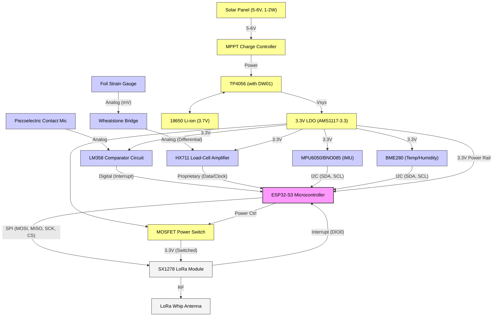
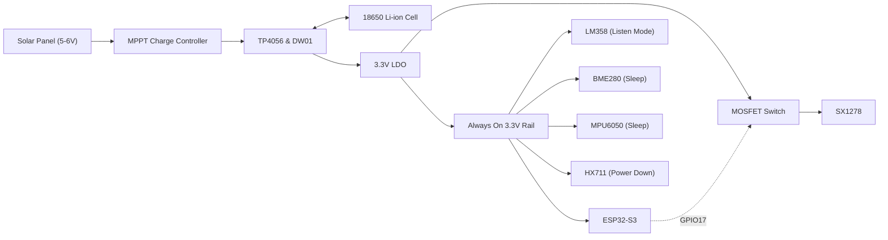
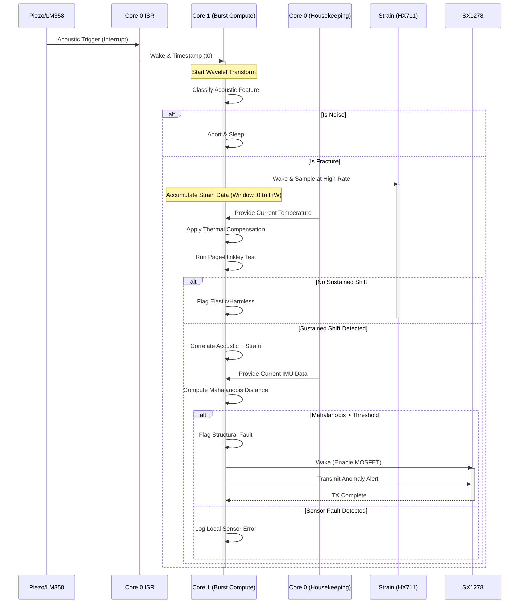

# System Interconnection

This document details the physical and logical connections of the ATF V-2.1 Edge-Processed Structural Health Monitoring (SHM) Node. It covers wiring, communication protocols, pin assignments, power distribution, and the data handoff mechanisms between subsystems.

---

## 1. Hardware Block Diagram

The following diagram illustrates the physical components and their connections to the central ESP32-S3 microcontroller.

---

## 2. ESP32-S3 GPIO Pin Assignment Table

The ESP32-S3 coordinates all peripheral communication. The following pin assignments balance the required protocols and peripheral layout.

| Pin | Function | Connected To | Protocol | Notes |
|-----|----------|-------------|----------|-------|
| **GPIO4** | Acoustic Trigger | LM358 Output | External Interrupt | Configured for rising edge. Wakes Core 1. |
| **GPIO5** | Data (DOUT) | HX711 | Proprietary | Input for 24-bit strain data. |
| **GPIO6** | Clock (PD_SCK) | HX711 | Proprietary | Output for clocking HX711 and setting gain. |
| **GPIO8** | SDA | MPU6050 & BME280 | I2C | Shared I2C data line. 4.7kΩ pull-up required. |
| **GPIO9** | SCL | MPU6050 & BME280 | I2C | Shared I2C clock line. 4.7kΩ pull-up required. |
| **GPIO11** | MOSI | SX1278 (LoRa) | SPI | Master Out Slave In. |
| **GPIO12** | MISO | SX1278 (LoRa) | SPI | Master In Slave Out. |
| **GPIO13** | SCK | SX1278 (LoRa) | SPI | SPI Clock. |
| **GPIO14** | CS (NSS) | SX1278 (LoRa) | SPI | Chip Select. Active low. |
| **GPIO15** | RST | SX1278 (LoRa) | GPIO | Hardware reset for LoRa module. |
| **GPIO16** | DIO0 | SX1278 (LoRa) | External Interrupt | Receive/Transmit complete notification. |
| **GPIO2** | Status LED | Onboard LED | GPIO | Debug and status indication. |
| **GPIO7** | Battery Monitor | Voltage Divider | ADC | Monitors 18650 cell voltage via 1/2 divider. |
| **GPIO17** | LoRa Power Enable | MOSFET Gate | GPIO | High to enable power to LoRa module. |

---

## 3. Communication Bus Details

### I2C Bus
- **Bus Speed:** 400 kHz (Fast Mode) for rapid data acquisition during periodic wake cycles.
- **Devices:** 
  - **BME280:** Address `0x76` (or `0x77` depending on SDO pin).
  - **MPU6050:** Address `0x68` (or `0x69` depending on AD0 pin).
- **Topology:** Shared bus. The ESP32 acts as the sole master. Only one device is addressed at a time.
- **Electrical Requirements:** 4.7kΩ pull-up resistors are required on both SDA and SCL lines to ensure fast enough rise times for 400 kHz operation.

### SPI Bus
- **Bus Speed:** Up to 10 MHz.
- **Device:** SX1278 LoRa Module.
- **Topology:** Full duplex. The CS (NSS) pin selects the LoRa module for communication.
- **Interrupts:** The DIO0 pin is connected to an interrupt-capable GPIO. It asserts when a packet is successfully transmitted or a preamble/packet is received, preventing the ESP32 from busy-waiting.

### HX711 Interface
- **Protocol:** Proprietary two-wire serial interface (Data and Clock). Not compatible with standard I2C or SPI.
- **Operation:** Provides 24-bit ADC readings. The clock rate is bit-banged or controlled by ESP32 GPIO toggling.
- **Configuration:** Gain and channel selection are determined by the number of clock pulses sent after data retrieval:
  - 25 pulses: Channel A, 128x gain (used for primary strain gauge).
  - 26 pulses: Channel B, 32x gain.
  - 27 pulses: Channel A, 64x gain.

### Piezo Comparator (Event Trigger)
- **Configuration:** An LM358 op-amp is configured as a comparator. A potentiometer creates a voltage divider to set a precise reference threshold.
- **Operation:** When the analog output from the piezoelectric microphone exceeds the reference threshold (a potential micro-fracture "snap"), the comparator output goes HIGH.
- **Interfacing:** This digital HIGH signal is connected to an ESP32 GPIO configured as a rising-edge interrupt. 
- **Design Philosophy:** There is no continuous ADC sampling of the piezo element. It is purely interrupt-driven to maintain extreme low power consumption, acting as the system's "wake-up" call.

---

## 4. Power Distribution

Power management is critical for the continuous, untethered operation of the edge node. 

### Power Budget Table

| Component | Active Current | Sleep Current | Duty Cycle | Power Source |
|-----------|---------------|---------------|------------|--------------|
| **ESP32-S3** | ~240 mA (compute/WiFi disabled) | ~10 µA (deep sleep) | <1% (burst compute) | 3.3V Rail |
| **BME280** | ~0.35 mA | ~0.1 µA | Sampled every 2-5s | 3.3V Rail |
| **MPU6050** | ~3.9 mA | ~5 µA | Sampled every 2-5s | 3.3V Rail |
| **HX711** | ~1.5 mA | ~1 µA (power down) | Event-triggered | 3.3V Rail |
| **SX1278** | ~120 mA (TX) | ~0.2 µA (sleep) | Rare alerts only | Switched 3.3V |
| **LM358** | ~0.7 mA | Always on (listening) | 100% | 3.3V Rail |

*Note: The SX1278 is placed behind a MOSFET load switch to guarantee zero leakage when communications are unnecessary.*

---

## 5. Inter-Subsystem Data Handoff

The architecture relies on a strict causal chain to minimize power and maximize diagnostic accuracy.

### Event Timeline and Data Flow

### Handoff Steps:
1. **Trigger:** The LM358 detects an acoustic threshold crossing. The hardware interrupt fires.
2. **Wake:** The Core 0 ISR sets a flag and captures a precise timestamp. Core 1 is woken from sleep.
3. **Acoustic Profiling:** Core 1 processes the buffered high-frequency analog input (if available via a parallel high-speed ADC config, or relies solely on the trigger profile) using wavelet transform to classify as noise or a micro-fracture candidate.
4. **Strain Correlation:** If a fracture candidate is confirmed, Core 1 begins rapidly polling the HX711 to monitor for a permanent baseline shift in strain.
5. **Thermal Compensation:** Core 0 provides the latest BME280 temperature reading. The Calibration Learner model applies the structure-specific thermal coefficient to yield compensated strain.
6. **Changepoint Detection:** The compensated strain series is fed into the Page-Hinkley algorithm to identify a statistically significant shift causally linked to the acoustic event timestamp.
7. **Fault Discrimination:** The aggregated state (acoustic event confidence, strain shift magnitude, current IMU tilt) forms a multivariate vector. The Fault Discriminator model computes the Mahalanobis distance from the normal baseline.
8. **Action:** If the distance indicates a structural fault (and not a decoupled sensor error), the ESP32 enables the MOSFET powering the SX1278 and transmits the alert packet over LoRa.

---

## 6. Physical Mounting and Cabling

Proper physical installation is critical for SHM accuracy, particularly on concrete highway bridges.

- **Node Enclosure:** IP65-rated weatherproof polycarbonate box. Mounted near the bridge deck joint, girder bearing, or pier depending on the monitoring target.
- **Strain Gauge:** Foil gauge must be surface-prepped and cyanoacrylate-bonded directly to the concrete surface. Leads are kept short and shielded, running into the HX711 module inside the enclosure.
- **Piezo Disk:** Must be rigidly clamped or epoxied flush to the concrete surface to capture high-frequency transients. Leads run to the LM358 circuit.
- **IMU:** The MPU6050/BNO085 breakout board must be rigidly mounted and epoxied to the base of the internal enclosure, perfectly aligned with the structure's primary gravity axis.
- **BME280:** Located inside the enclosure. A shielded ventilation gland is required to allow ambient temperature and humidity to equalize without admitting water.
- **Solar Panel:** Mounted on the top or south-facing exterior surface of the enclosure.
- **LoRa Antenna:** A short whip antenna connected via an SMA bulkhead connector passing through the enclosure wall.

---

## 7. Wiring Schematic Notes

For schematic capture (e.g., in KiCad):

1. **Power:** Ensure a stable 3.3V rail capable of 500mA peak (for ESP32 WiFi/boot spikes, though WiFi is unused here). Place 10µF and 0.1µF decoupling capacitors near the ESP32, IMU, and LoRa modules.
2. **I2C:** Do not forget the 4.7kΩ pull-up resistors on GPIO8 and GPIO9 to 3.3V.
3. **Analog Front End:** The connection between the Wheatstone bridge and HX711 should be as short as possible. Use twisted pairs for the differential signal to reject common-mode noise.
4. **Interrupt:** The LM358 output (GPIO4) should have a weak pull-down resistor (10kΩ) to prevent floating triggers during power-up or op-amp instability.
5. **LoRa Switching:** Use a logic-level P-channel MOSFET (e.g., AO3401) on the high side to switch power to the SX1278. The ESP32 GPIO17 should drive an N-channel MOSFET or BJT which in turn pulls the P-channel gate low to enable power. This ensures default-off behavior.
6. **Battery Monitoring:** Use a 100kΩ / 100kΩ voltage divider from the battery positive terminal to GPIO7. Add a 0.1µF capacitor from GPIO7 to ground to stabilize the ADC reading.
