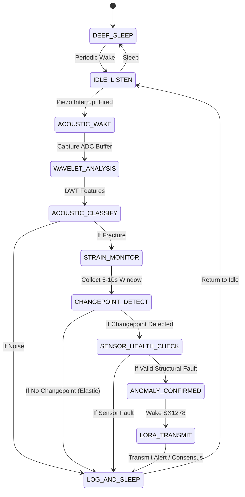
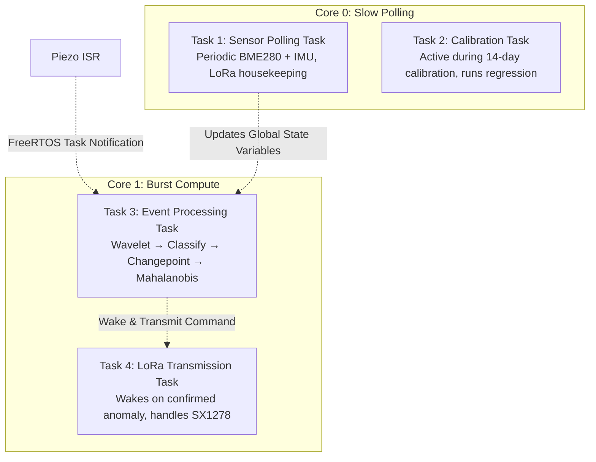
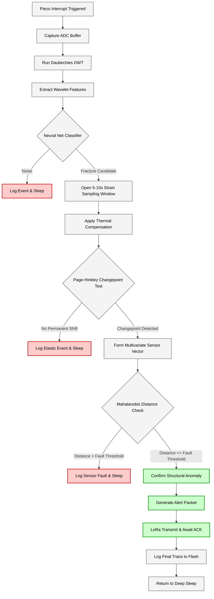

# 06 Data Flow Pipeline

This document describes the END-TO-END data journey from sensor measurement to LoRa alert for the ATF V-2.1 Edge-Processed Structural Health Monitoring (SHM) Node. It includes the state machine, FreeRTOS task structure, and timing budgets.

## 1. Pipeline Overview

The ATF V-2.1 SHM Node is **NOT continuously processing**. Instead, it utilizes an **event-triggered pipeline**, spending the vast majority of its time in deep sleep to conserve power. 

The pipeline activates in discrete stages following an acoustic trigger. Each stage acts as a "gate" that evaluates the event. If a stage determines the event is benign (e.g., noise, non-permanent elastic strain, or a sensor fault), the pipeline actively rejects the event, logs the outcome, and returns the system to sleep. This cascaded rejection minimizes power-hungry downstream processing and transmission.

## 2. State Machine

The complete system behavior is governed by the following state machine:

- **DEEP_SLEEP**: ESP32-S3 in deep sleep. Only the LM358 comparator is powered, monitoring the piezo contact microphone.
- **IDLE_LISTEN**: Core 0 active for slow periodic polling (BME280, IMU every 2-5s). Core 1 remains sleeping. Piezo interrupt is armed.
- **ACOUSTIC_WAKE**: Piezo interrupt fires. Core 1 wakes and captures the ADC buffer.
- **WAVELET_ANALYSIS**: Core 1 executes the Daubechies wavelet transform on the captured acoustic buffer.
- **ACOUSTIC_CLASSIFY**: Wavelet features are fed to the TinyML classifier. If classified as noise, the event is logged and the system returns to IDLE_LISTEN.
- **STRAIN_MONITOR**: Opens a high-resolution strain sampling window (5-10 seconds) to capture the structural response to the acoustic event.
- **CHANGEPOINT_DETECT**: Executes a Page-Hinkley changepoint test on the thermally-compensated strain stream. If no permanent changepoint is found, it is logged as an elastic/harmless event and returns to IDLE_LISTEN.
- **SENSOR_HEALTH_CHECK**: Calculates the Mahalanobis distance on the full multivariate sensor vector. If a sensor fault (e.g., debonding) is detected, it logs the fault and returns to IDLE_LISTEN.
- **ANOMALY_CONFIRMED**: All verification gates passed. A structural anomaly is confirmed.
- **LORA_TRANSMIT**: Wakes the SX1278 module, encrypts the alert, and transmits. In a multi-node setup, it may broadcast as provisional and wait for consensus.
- **LOG_AND_SLEEP**: Logs the final event trace to flash memory and returns to IDLE_LISTEN or DEEP_SLEEP.

## 3. FreeRTOS Task Architecture

The dual-core ESP32-S3 runs FreeRTOS. Core 0 handles low-priority polling, while Core 1 handles high-priority burst compute.

- **Task 1 (Core 0)**: Sensor Polling Task — Executes periodic BME280 (temperature/humidity) and IMU (tilt) reads. Manages LoRa network housekeeping.
- **Task 2 (Core 0)**: Calibration Task — Only active during the initial 14-day deployment. Runs linear regression for thermal compensation learning.
- **Task 3 (Core 1)**: Event Processing Task — The core analytical engine. Wakes upon ISR notification, executes the entire evaluation pipeline sequentially.
- **Task 4 (Core 1)**: LoRa Transmission Task — Activated only when Task 3 confirms an anomaly. Manages SX1278 packet construction, encryption, and acknowledgment.
- **ISR**: Hardware interrupt handler for the LM358 comparator. Captures the precise timestamp and notifies Task 3.

## 4. Timing Budget

The following table estimates the processing time required for each pipeline stage.

| Stage | Duration | Core | Notes |
|-------|----------|------|-------|
| Piezo interrupt + buffer capture | ~10 ms | ISR + Core 1 | 1024 samples at 100 kHz |
| Wavelet transform | ~50-100 ms | Core 1 | Daubechies DWT, 3-level decomposition |
| Acoustic classification | ~5-20 ms | Core 1 | Small NN, INT8 quantized |
| Strain monitoring window | 5-10 s | Core 1 | HX711 at 80 SPS |
| Thermal compensation | <1 ms | Core 1 | Coefficient multiplication |
| Page-Hinkley test | ~1-5 ms | Core 1 | Runs incrementally per sample |
| Mahalanobis distance | <1 ms | Core 1 | Matrix multiplication |
| Decision logic | <1 ms | Core 1 | Threshold comparison |
| LoRa transmission | ~100-500 ms | Core 1 | Depending on spreading factor (SF) |
| **Total active time per event** | **~6-11 s** | | **Dominated by strain sampling window** |

## 5. Data Formats at Each Stage

Data transforms significantly as it propagates through the pipeline:

- **Piezo ADC buffer**: `int16_t[1024]`
- **Wavelet coefficients**: `float32` arrays per decomposition level
- **Acoustic features**: `float32[6]` (Energy per level + summary statistical features)
- **Classifier output**: `float32[2]` (Probability of fracture, Probability of noise)
- **Strain readings**: `float32[800]` (80 Samples/sec × 10s window)
- **Compensated strain**: `float32[800]` (After subtracting thermal expansion offset)
- **Changepoint result**: `struct { bool detected; float magnitude; float confidence; uint32_t sample_index; }`
- **Sensor vector**: `float32[4]` (acoustic_energy, strain_delta, tilt_delta, temperature)
- **Mahalanobis distance**: `float32` scalar
- **Alert packet**: `struct { uint32_t timestamp; uint16_t node_id; uint8_t anomaly_type; float confidence; float sensor_summary[4]; }`

## 6. Event Logging

To ensure traceability and long-term algorithmic tuning, all events are logged, including those rejected by early pipeline stages.

- **Storage**: Logged to ESP32-S3 internal flash using SPIFFS or LittleFS.
- **Log Format**: `[Timestamp], [Event Type], [Pipeline Stage Reached], [Key Measurements], [Final Decision]`
- **Memory Management**: Flash memory acts as a circular buffer; the oldest events are systematically overwritten when full.
- **Retrieval**: Logs can be downloaded over the LoRa network upon a specific request from the central gateway.

## 7. Pipeline Flow Diagram

