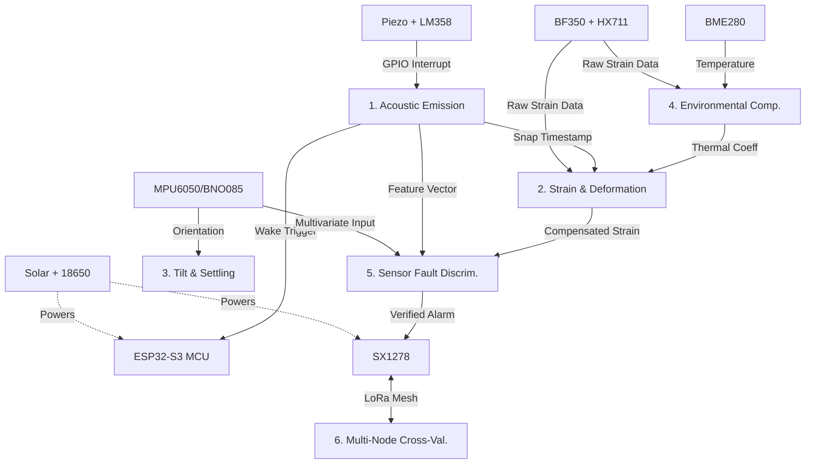

# 07. Hardware Bill of Materials (BOM)

This document details the Hardware Bill of Materials for the ATF V-2.1 Edge-Processed Structural Health Monitoring (SHM) Node, mapping each physical component to the core subsystems it supports.

## 1. Core Node Bill of Materials (Per Unit)

The following components are required for a single, fully-functional prototype node.

| Component | Specification | Purpose | Subsystem(s) | Interface | Est. Cost (INR) |
| :--- | :--- | :--- | :--- | :--- | :--- |
| **ESP32-S3 Dev Board** | Dual-core 240MHz, 512KB SRAM, 8MB PSRAM, vector instructions | Central MCU for all processing, deep sleep, and edge inference | All subsystems | N/A (master) | ₹450 |
| **BF350 Strain Gauge + ADC/Amp Module** | 350Ω foil gauge, Wheatstone bridge, HX711 24-bit ADC | Measures physical deformation of the structure | Subsystem 2 (Strain), Subsystem 4 (Thermal Cal) | GPIO (2-wire proprietary) | ₹250 |
| **Piezo Disk + LM358 Comparator Module** | High-frequency piezoelectric contact mic, op-amp comparator with threshold | Captures acoustic emissions for micro-fracture detection | Subsystem 1 (Acoustic) | GPIO interrupt | ₹180 |
| **MPU6050 / BNO085 IMU** | 6-axis MEMS (accel + gyro), BNO085 has better long-term stability | Tracks structural tilt and macro-vibration | Subsystem 3 (Tilt), Subsystem 5 (Sensor Health) | I2C (0x68) | ₹150–₹900 |
| **BME280** | Temperature (±1°C), humidity (±3%), pressure | Ambient conditions for thermal compensation | Subsystem 4 (Environmental) | I2C (0x76) | ₹300 |
| **SX1278 LoRa Module** | 865-867 MHz (India ISM), up to 15 km range, SPI interface | Low-power alert transmission | Subsystem 6 (Multi-Node), Alert TX | SPI + GPIO interrupt | ₹400 |
| **Small Solar Panel** | 5-6V, 1-2W + MPPT/charge controller | Off-grid power generation | Power system | Analog (voltage) | ₹500 |
| **18650 Li-ion Cell + TP4056** | 3.7V, 2600-3400 mAh, with DW01 protection | Battery buffer for night/overcast | Power system | Power rail | ₹250 |
| **Prototyping Consumables** | Cyanoacrylate, breadboard, enclosure (IP65), jumper wires, resistors, capacitors | Assembly and mounting | All | N/A | ₹250 |

**Total Estimated Cost: ~₹2,730 per node** (using MPU6050)

## 2. Second Node (Optional — Multi-Node Consensus)

For testing **Subsystem 6 (Multi-Node Cross-Validation)**, a minimum of two nodes is required.
- **Specification:** Identical BOM, deployed at a different mounting point on the same concrete bridge span.
- **Combined Cost (2 Nodes):** ~₹5,460.
- **Purpose:** Allows neighboring nodes to independently report and correlate anomalies within a shared time/confidence window to achieve distributed consensus without cloud dependency.

## 3. Component-to-Subsystem Mapping Diagram

## 4. Component Selection Rationale

The BOM was optimized for a balance of **cost, low-power constraints, and signal fidelity** required for concrete highway bridge SHM.

* **ESP32-S3 Dev Board:** Chosen for its vector instructions which accelerate TinyML and Daubechies wavelet transforms. The dual-core architecture is critical for FreeRTOS separation (Core 0 for slow polling, Core 1 for burst compute).
* **HX711 (with BF350):** The 24-bit ADC is essential to achieve a low enough noise floor for Page-Hinkley changepoint detection. Minor baseline shifts must be separable from analog noise.
* **LM358 Comparator:** Rather than continuous ADC polling (which drains the battery), the LM358 provides a low-power hardware comparator. It wakes the ESP32-S3 via a GPIO interrupt only when the acoustic threshold (a potential micro-fracture snap) is crossed.
* **MPU6050 vs. BNO085 Trade-off:** The MPU6050 is sufficient for cost-sensitive prototyping. However, for production deployments requiring multi-year stability, the BNO085 is recommended due to its integrated sensor fusion and significantly lower long-term drift.
* **BME280:** Accurate ambient temperature reading is non-negotiable for the calibration regression learner. A ±1°C accuracy is required to reliably extract the structure-specific thermal-expansion coefficient.
* **SX1278 LoRa Module:** Uses the 865-867 MHz India ISM band, remaining compliant with local regulations while providing the penetration and range required for concrete environments and mesh consensus.

## 5. Procurement Notes

* **Strain ADC Quality:** Pro-tip — ensure the HX711 modules have proper shielding. High noise floors on cheap generic modules will destroy the sensitivity of the CUSUM/Page-Hinkley algorithms, leading to false negatives on strain baseline shifts.
* **Supplier Consistency:** For reproducible machine learning baselines and calibration reliability, components (especially the piezo disks and IMUs) should be sourced from consistent batches.
* **Local Availability:** All components are readily available from standard Indian electronics distributors such as Robu.in, ElectronicsComp, or Amazon.in.

## 6. Production Scaling Notes

* **Prototype Phase:** The current BOM relies on hand-wired, off-the-shelf breakout modules suitable for proof-of-concept testing.
* **Production Phase:** Future revisions will move to a custom PCB that integrates the MCU, sensor amplifiers, power management, and LoRa transceiver onto a single board. This will reduce per-node footprint, improve weather resistance, and optimize the total cost at scale.
* For detailed next steps on PCB integration and system scaling, refer to [13. Scalability Roadmap](./13_Scalability_Roadmap.md).
