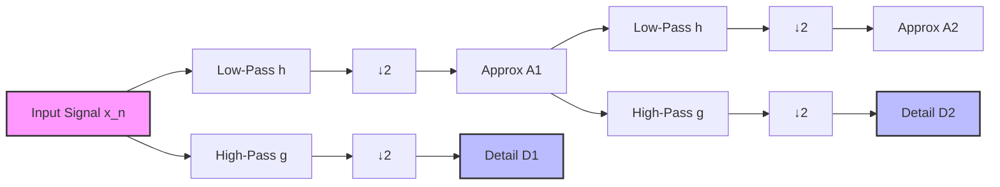

# Mathematical Foundations

> [!NOTE]
> This document serves as the comprehensive mathematical reference for the ATF V-2.1 Edge-Processed Structural Health Monitoring (SHM) Node project. It details the formal mathematical basis for all signal processing, statistical testing, multivariate analysis, and regression methods used in the system.

## 1. Overview

The ATF V-2.1 system employs a rigorous suite of applied mathematics to achieve reliable, low-power structural health monitoring. Unlike traditional cloud-dependent systems that stream raw data, the V-2.1 node processes data at the edge. This requires computationally efficient yet mathematically robust algorithms tailored to the ESP32-S3 microcontroller. 

The core mathematical architecture spans four main areas:
1. **Time-Frequency Signal Processing** for transient acoustic event detection (Wavelet Transform).
2. **Statistical Time-Series Analysis** for identifying causal shifts in structural strain (Page-Hinkley Changepoint Detection).
3. **Linear Algebra & Regression** for baseline environmental compensation.
4. **Multivariate Statistics** for distinguishing between sensor degradation and genuine structural anomalies (Mahalanobis Distance).

The document strictly delineates between **CORE (Prototype)** features and **PHASE 2 (Stretch)** enhancements.

---

## 2. Wavelet Transform (Acoustic Emission Processing)

**Status: CORE (Prototype)**

### Why Not FFT?
The Fast Fourier Transform (FFT) decomposes signals into infinite sinusoidal bases, making it optimal for continuous, stationary signals. However, concrete micro-fractures manifest as short, sharp, non-periodic transient snaps. Using FFT on transients smears the energy across the frequency spectrum, losing the precise temporal start time (the "snap"). Wavelets resolve both *time* AND *frequency*, which is critical for correlating acoustic events with immediate strain changes.

### Continuous Wavelet Transform (CWT)
The formal definition of the CWT is given by:

$$W(a,b) = \frac{1}{\sqrt{|a|}} \int_{-\infty}^{\infty} x(t) \psi^*\left(\frac{t-b}{a}\right) dt$$

Where:
- $\psi$ is the "mother wavelet", a zero-mean, finite-energy function.
- $a$ is the scale parameter (inversely proportional to frequency).
- $b$ is the translation parameter (representing time).
- $*$ denotes the complex conjugate.

### Discrete Wavelet Transform (DWT)
For edge computing on the ESP32-S3, calculating the CWT is computationally prohibitive ($O(N^2)$). Instead, the system uses the Discrete Wavelet Transform ($O(N)$), implemented via Mallat's algorithm.

Mallat's algorithm uses a multi-resolution filter bank where the signal passes through sequential low-pass ($h[n]$) and high-pass ($g[n]$) filters, followed by decimation (downsampling by 2).

- **Levels 1–3 (Details):** Capture the high-frequency content characteristic of concrete fracture snaps.
- **Levels 4+ (Approximations):** Capture low-frequency rumble (traffic, wind) and are discarded to filter out noise.

### Daubechies Wavelet Basis
We employ the **Daubechies (db4 or db6)** mother wavelet.
- **Why Daubechies?** It possesses compact support (finite length), orthogonality, and excellent time-frequency localization. The asymmetric shape of db4 tightly matches the physical pulse profile of a sudden structural snap followed by rapid decay.
- **Vanishing Moments:** A db-N wavelet has $N$ vanishing moments. This means it is orthogonal to polynomials up to degree $N-1$, effectively ignoring slow baseline wandering in the acoustic signal.

### Energy Thresholding
Anomaly detection is performed by calculating the total energy $E_j$ in the high-frequency detail bands:

$$E_j = \sum_{k} |d_j[k]|^2$$

Where $d_j[k]$ are the detail coefficients at decomposition level $j$. If the aggregate energy in the target levels ($E_1 + E_2 + E_3$) exceeds a dynamically calibrated threshold, an acoustic transient (potential fracture) is flagged, waking Core 1 for strain correlation.

*For rigorous theoretical prerequisites, see: [Vector Spaces](../Maths/Vector%20Space.md), [Hilbert Spaces](../Maths/Hilbert%20Space.md), [Measure Theory](../Maths/Measure%20Theory.md), [Projection Theorem](../Maths/Projection%20Theorem.md), and [Bases](../Maths/Bases.md).*

---

## 3. Page-Hinkley Changepoint Detection (Strain Analysis)

**Status: CORE (Prototype)**

### Purpose
Once an acoustic snap provides a precise timestamp, the system must evaluate the causally correlated strain data to determine if a permanent, plastic deformation occurred. The Page-Hinkley test mathematically identifies when a time series shifts to a new statistical regime, robust to temporary elastic noise.

### Algorithm
Given a sequence of strain readings $x_1, x_2, \dots, x_n$:

1. **Maintain Running Mean:** 
   $$\bar{x}_n = \frac{1}{n} \sum_{i=1}^{n} x_i$$
2. **Cumulative Sum of Deviations:** 
   $$U_n = \sum_{i=1}^{n} (x_i - \bar{x}_n - \delta)$$
3. **Running Minimum:** 
   $$m_n = \min_{1 \leq i \leq n} U_n$$
4. **Test Statistic:** 
   $$PH_n = U_n - m_n$$
5. **Detection:** A changepoint is flagged if $PH_n > \lambda$.

### Parameters
- $\delta$ **(Allowance Factor):** The minimum magnitude of shift considered structurally significant. For concrete highway bridges, this is tuned near the plastic deformation threshold (~200–500 microstrain).
- $\lambda$ **(Threshold):** Controls the sensitivity/false-alarm tradeoff. A higher $\lambda$ reduces false positives at the cost of slightly slower detection.

### Page-Hinkley vs. CUSUM
Page-Hinkley is mathematically optimized for detecting unidirectional mean shifts (e.g., strain increasing monotonically after a fracture). It uses less memory than standard CUSUM and is faster to compute on the ESP32-S3.

**CUSUM Alternative Formulation:**
If bidirectional shifts are required, the standard CUSUM algorithm maintains upper and lower bounds:
$$S_n^+ = \max(0, S_{n-1}^+ + (x_n - \mu_0 - k))$$
$$S_n^- = \max(0, S_{n-1}^- - (x_n - \mu_0 + k))$$
Detection occurs when either $S_n^+$ or $S_n^-$ exceeds threshold $h$.

---

## 4. Linear/Polynomial Regression (Thermal Calibration)

**Status: CORE (Prototype)**

Structural strain fluctuates massively with ambient temperature. The system learns a structure-specific thermal-expansion coefficient over a 14-day autonomous calibration period.

### Ordinary Least Squares (OLS)
For a design matrix $X$ (temperature variables) and response vector $y$ (strain), the optimal coefficient vector $\hat{\beta}$ is:

$$\hat{\beta} = (X^T X)^{-1} X^T y$$

### On-Device Simplification
Matrix inversion is expensive on microcontrollers. For a simple linear model ($y = \beta_0 + \beta_1 T$), the ESP32-S3 maintains cumulative sufficient statistics: $\sum T_i$, $\sum S_i$, $\sum T_i S_i$, $\sum T_i^2$, and $n$.
The coefficients are computed directly without matrix operations:

$$\beta_1 = \frac{n \sum T_i S_i - (\sum T_i)(\sum S_i)}{n \sum T_i^2 - (\sum T_i)^2}$$
$$\beta_0 = \frac{\sum S_i - \beta_1 \sum T_i}{n}$$

### Polynomial Extension
If thermal behavior is non-linear (e.g., composite material bridges), the model expands to quadratic regression:
$$y = \beta_0 + \beta_1 T + \beta_2 T^2$$

### Validation & Application
- **Validation Threshold:** $R^2 = 1 - \frac{SS_{res}}{SS_{tot}}$. The calibration is accepted only if $R^2 > 0.85$.
- **Application:** During active monitoring, the expected thermal strain is subtracted from the raw reading:
  $$\text{strain}_{compensated} = \text{strain}_{raw} - (\beta_0 + \beta_1 \cdot T_{current})$$

---

## 5. Mahalanobis Distance (Sensor-Fault Discrimination)

**Status: CORE (Prototype)**

### Definition
To discriminate between a genuine structural fault (e.g., a crack altering strain and tilt) and a sensor fault (e.g., a debonding strain gauge), we treat the multi-sensor readings as a single multivariate point $\mathbf{x} = [\text{Strain}, \text{Tilt}_X, \text{Tilt}_Y, \text{Temp}]^T$. 

The Mahalanobis Distance $D_M$ from the normal operational state is:

$$D_M(\mathbf{x}) = \sqrt{(\mathbf{x} - \boldsymbol{\mu})^T \Sigma^{-1} (\mathbf{x} - \boldsymbol{\mu})}$$

Where:
- $\boldsymbol{\mu}$ is the mean vector of the healthy state.
- $\Sigma$ is the covariance matrix of the healthy state.

### Why Not Euclidean Distance?
Euclidean distance treats all variables as independent and equally scaled. Mahalanobis distance scales dimensions by their variance and accounts for inter-variable correlations (e.g., how strain and temperature naturally rise together). An anomaly that breaks this natural correlation (e.g., strain jumps but temp/tilt remain flat) yields a massive $D_M$ spike, flagging a likely sensor failure.

### On-Device Implementation & Thresholding
- **Efficiency:** The $4 \times 4$ inverse covariance matrix $\Sigma^{-1}$ is computed *once* at the end of the 14-day calibration. Real-time inference is reduced to simple matrix-vector multiplication.
- **Statistical Threshold:** Assuming multivariate normality, $D_M^2$ follows a Chi-Square ($\chi^2$) distribution with $p$ degrees of freedom (where $p$ is the number of sensors). A fault is flagged if $D_M^2 > \chi^2_{0.99, p}$ (99% confidence interval).

---

## 6. Euler-Bernoulli Beam Deflection

> [!WARNING]
> **Status: PHASE 2 (Future Stretch Goal)**
> This "Digital Twin" physics-informed modeling is NOT part of the current V-2.1 prototype scope.

### Beam Equation
To validate observed strain against physics-based expectations, a simplified model of the bridge deck uses the Euler-Bernoulli equation:

$$\frac{d^2}{dx^2}\left(EI \frac{d^2 w}{dx^2}\right) = q(x)$$

Where $E$ is Young's Modulus, $I$ is the area moment of inertia, $w$ is deflection, and $q(x)$ is the distributed load.

### Simply Supported Beam Approximation
For a point load $P$ at the center, maximum deflection ($\delta_{max}$) and maximum stress ($\sigma_{max}$) are:
$$\delta_{max} = \frac{PL^3}{48EI}$$
$$\sigma_{max} = \frac{PL}{4Z}$$
(where $Z$ is the section modulus).

### On-Device Application
Because solving differential equations in real-time is too costly, the Phase 2 firmware will reduce this to a pre-calculated lookup table or polynomial curve. The anomaly score is the residual $R$:
$$R = |\epsilon_{observed} - \epsilon_{predicted}|$$

---

## 7. Dempster-Shafer Evidence Theory

> [!WARNING]
> **Status: PHASE 2 (Future Stretch Goal)**
> Formal evidence fusion is NOT part of the current V-2.1 prototype scope.

When scaling to complex arrays, conflicting data may arise (e.g., acoustic detects snap, but strain detects no shift). Dempster-Shafer provides a framework for reasoning under uncertainty.

### Basic Probability Assignment (BPA)
Mass functions map the power set of all possible system states ($\Theta$) to probabilities: 
$$m: 2^\Theta \to [0,1]$$

### Combination Rule
Evidences from two independent subsystems (e.g., $m_1$ from Acoustic, $m_2$ from Strain) are fused:

$$m_{12}(A) = \frac{1}{1-K} \sum_{B \cap C = A} m_1(B) \cdot m_2(C)$$

Where $K$ represents the fundamental conflict between the sources:
$$K = \sum_{B \cap C = \emptyset} m_1(B) \cdot m_2(C)$$

### Belief and Plausibility
- **Belief (Lower Bound):** $Bel(A) = \sum_{B \subseteq A} m(B)$
- **Plausibility (Upper Bound):** $Pl(A) = \sum_{B \cap A \neq \emptyset} m(B)$

---

## 8. Summary Table

| Method | Subsystem | Purpose | Complexity | Phase |
|--------|-----------|---------|------------|-------|
| **Discrete Wavelet Transform** | Acoustic Emission | Detect micro-fracture transients precisely in time/frequency without smearing | $O(N)$ | CORE |
| **Page-Hinkley Test** | Strain & Deformation | Detect causal, sustained baseline shifts post-acoustic event | $O(1)$ per sample | CORE |
| **Linear Regression** | Environmental Comp. | Learn and subtract thermal expansion from raw strain | $O(1)$ per sample | CORE |
| **Mahalanobis Distance** | Fault Discrimination | Catch sensor debonding by detecting broken inter-variable correlation | $O(p^2)$ matrix mult. | CORE |
| **Euler-Bernoulli** | Residual Modeling | Compare observed strain to physical load predictions | Lookup / $O(1)$ | PHASE 2 |
| **Dempster-Shafer** | Data Fusion | Merge conflicting subsystem outputs with explicit uncertainty bounds | $O(2^{|\Theta|})$ | PHASE 2 |
