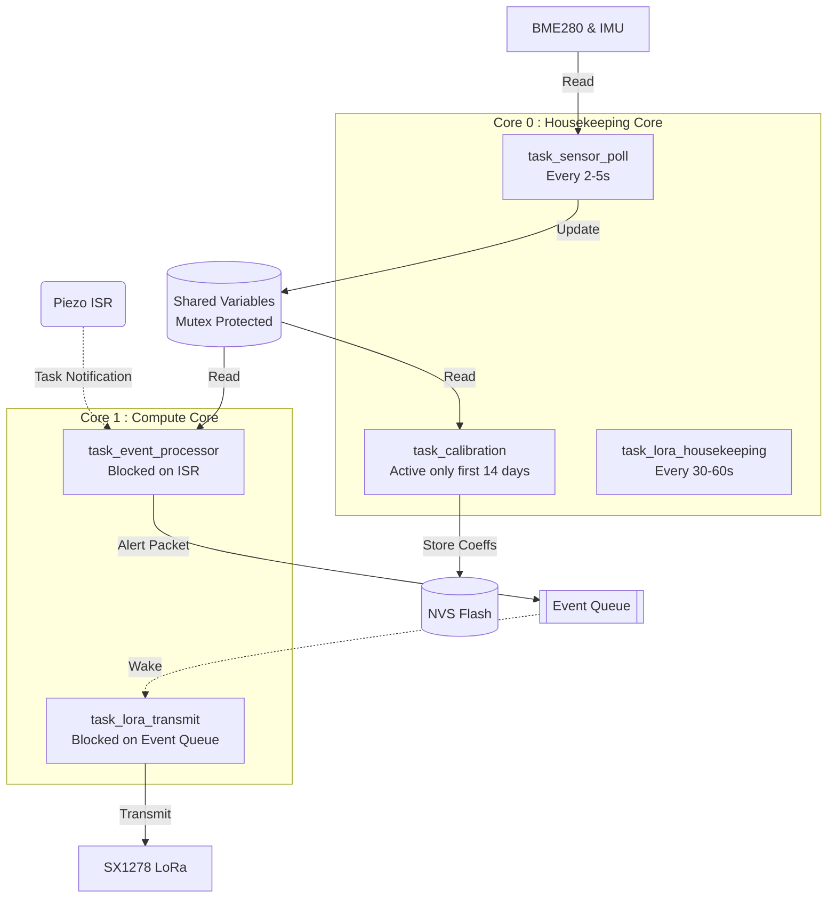
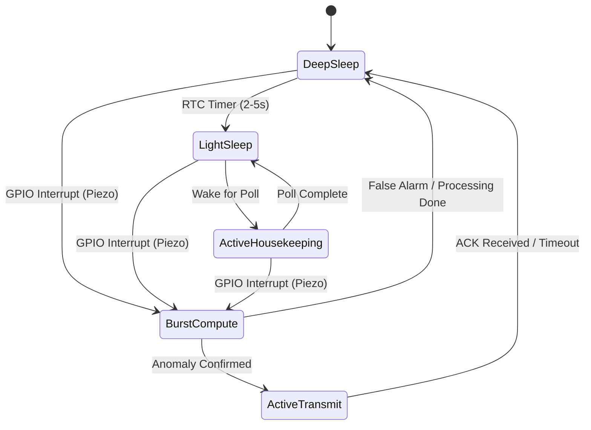

# ATF V-2.1 Firmware Architecture (ESP32-S3)

## 1. Overview

The ATF V-2.1 edge node is powered by an ESP32-S3 microcontroller, featuring a dual-core Xtensa LX7 processor running at 240 MHz. The firmware is built on the FreeRTOS real-time operating system using the ESP-IDF framework, written in C/C++. 

The system employs a strictly event-driven architecture designed for extremely low power consumption. The device spends the vast majority of its operational life in low-power states, waking only for periodic environmental polling or in response to interrupt-driven structural acoustic events.

## 2. Dual-Core Task Allocation

To maximize responsiveness and separate critical burst-compute workloads from routine polling, tasks are explicitly pinned to specific cores. Core 0 handles all routine, low-priority tasks, while Core 1 is reserved for compute-intensive signal processing and inference.

### Core 0 (Housekeeping Core)
- **`task_sensor_poll`**: Responsible for periodic reads from the BME280 (temperature/humidity) and the IMU (tilt) via I2C every 2-5 seconds. It updates shared variables protected by mutexes and runs in a loop yielding via `vTaskDelay()`.
- **`task_calibration`**: Active exclusively during the initial 14-day calibration phase. It logs paired (temperature, strain) samples to PSRAM/flash. Upon completion, it runs a regression to extract the structure-specific thermal coefficient, stores it in non-volatile storage (NVS), and deletes itself to free memory.
- **`task_lora_housekeeping`**: Maintains the LoRa mesh network. It listens for incoming consensus queries from neighboring nodes and handles OTA firmware update requests. It runs at a low priority every 30-60 seconds.

### Core 1 (Compute Core)
- **`task_event_processor`**: The core data pipeline. It remains blocked on an ISR notification and wakes to execute the full processing pipeline: Wavelet transform → acoustic classification → strain monitoring → changepoint detection → Mahalanobis distance check → final decision. It runs at the highest priority on Core 1.
- **`task_lora_transmit`**: Remains blocked on an event queue. When it receives an alert packet from the event processor, it wakes up, powers on the SX1278 via a dedicated MOSFET, transmits the alert, waits for an ACK, and powers the radio off again.

## 3. Interrupt Service Routine (ISR) Design

Acoustic events are unpredictable and transient, requiring microsecond-level responsiveness. The high-frequency piezoelectric contact microphone is routed through an LM358 comparator circuit, whose output is tied to a GPIO pin configured for rising-edge interrupts.

- **Fast Execution (<10µs)**: The ISR is marked to run entirely from internal IRAM to prevent flash cache misses.
- **Responsibilities**:
  1. Captures a high-resolution timestamp using `esp_timer_get_time()`.
  2. Sets a flag in a FreeRTOS notification using `xTaskNotifyFromISR()` to unblock `task_event_processor`.
- **Deferred Processing**: The ISR does *not* read ADC values or perform computations. All processing is deferred to the event processor task.
- **Debouncing**: To prevent re-triggering from a single prolonged fracture sound, the ISR implements a minimum 100ms hardware/software debounce window.

## 4. Memory Layout

The ESP32-S3 utilizes Internal SRAM, external PSRAM, and Flash memory to balance performance and storage constraints.

| Memory Region | Size | Usage |
|---------------|------|-------|
| **Internal SRAM** | 512 KB | FreeRTOS heap, task stacks, TFLite arena, wavelet buffers, shared variables (requires fast access). |
| **PSRAM** | 8 MB | Calibration data storage, historical event logs, large intermediate buffers. |
| **Flash** | 16 MB | Firmware (app partition), TFLite model file, NVS (coefficients), SPIFFS/LittleFS (event logs). |

### Flash Partition Table

| Partition | Type | Size | Purpose |
|-----------|------|------|----------|
| `nvs` | data | 24 KB | Calibration coefficients, covariance matrix, mean vector, node ID. |
| `phy_init` | data | 4 KB | PHY calibration data. |
| `factory` | app | 4 MB | Main firmware application. |
| `model` | data | 512 KB | TFLite acoustic classification model file. |
| `spiffs` | data | 4 MB | Persistent event logs for offline retrieval. |
| `ota_0` | app | 4 MB | OTA update partition. |

## 5. Power Management

The primary constraint of the solar-powered node is the energy budget. 

- **Deep Sleep**: The ESP32-S3 enters deep sleep when no events are expected. The ultra-low-power (ULP) coprocessor or RTC timer manages wakeups. Wake sources are the GPIO (piezo interrupt) or the RTC timer (for periodic sensor polls).
- **Light Sleep**: Employed between sensor polls on Core 0 when short delays are required. This preserves RAM and peripheral states while saving ~50% power compared to active idle.
- **Modem Sleep**: The WiFi/Bluetooth radios are permanently disabled.
- **Peripheral Power**: The LoRa SX1278 transceiver is aggressively power-gated via an external MOSFET. It is physically disconnected from power when not transmitting.

## 6. Shared Data and Synchronization

Because tasks operate concurrently across two cores, data consistency is maintained using FreeRTOS synchronization primitives.

### Shared Variables
- `current_temperature` (float, mutex-protected)
- `current_humidity` (float)
- `current_tilt` (float[3] — x, y, z angles)
- `thermal_coefficient` (float, written by calibration task, read by event processor)
- `covariance_matrix` (float[4][4], written during calibration)
- `mean_vector` (float[4], written during calibration)
- `calibration_complete` (bool, set once after the 14-day phase)

### Primitives
- **Mutexes**: Protect shared state variables (e.g., temperature) from race conditions when Core 0 writes and Core 1 reads.
- **Task Notifications**: Lightweight binary semaphores (`xTaskNotify`) are used for unblocking tasks from ISRs.
- **Message Queues**: Used to pass complex data structures (like alert packets) safely from `task_event_processor` to `task_lora_transmit`.

## 7. Boot Sequence

1. **Boot**: ESP32-S3 boots from the `factory` flash partition.
2. **NVS Initialization**: Checks for stored calibration coefficients and system state.
3. **I2C Initialization**: Sets up the bus for the BME280 and IMU.
4. **ADC Initialization**: Configures GPIO pins for the HX711 strain gauge amplifier.
5. **SPI & LoRa Initialization**: Sets up the SPI bus for the SX1278 LoRa module, then immediately puts the SX1278 to sleep via MOSFET.
6. **Interrupt Configuration**: Sets up the piezo comparator GPIO for rising-edge interrupts.
7. **Model Loading**: Loads the TFLite acoustic model from the flash `model` partition into the SRAM arena.
8. **Calibration Check**: If `calibration_complete == false`, launches `task_calibration` on Core 0.
9. **Task Creation (Core 0)**: Starts `task_sensor_poll` and `task_lora_housekeeping`.
10. **Task Creation (Core 1)**: Starts `task_event_processor` and `task_lora_transmit`.
11. **Arming**: Arms the piezo interrupt.
12. **Run Loop**: Enters normal operation loop (FreeRTOS scheduler takes over).

## 8. Error Handling

Robust error handling ensures the node remains autonomous and self-healing in remote environments.

- **Watchdog Timers (WDT)**: Enabled on both Core 0 and Core 1 with a 15-second timeout. If a task hangs, the hardware watchdog triggers a system reset.
- **Task Crashes**: If `task_event_processor` crashes, FreeRTOS catches the exception, logs the error to SPIFFS, and restarts the task.
- **Sensor Failures**: If an I2C sensor read fails, the system retries 3 times. If it still fails, the sensor is flagged as faulty, triggering a health alert over LoRa.
- **Transmission Failures**: If LoRa transmission fails (no ACK), the alert packet is stored in flash memory, and the system attempts to retry during the next cycle.
- **Critical Faults**: Unrecoverable errors result in a deliberate software reboot (`esp_restart()`) to restore a known good state.

## 9. OTA Update Strategy

To maintain remote field deployments, the firmware supports Over-The-Air (OTA) updates.

- **Delivery Mechanism**: Updates are delivered via LoRa (as small incremental patches to conserve bandwidth) or via USB/serial during scheduled physical maintenance.
- **Two-Partition Scheme**: Uses standard ESP-IDF rollback safety. The flash has `factory` and `ota_0` partitions. The system downloads the update to the inactive partition, verifies the checksum, and changes the boot pointer. If the new firmware crashes upon boot, the ESP32 automatically rolls back to the previous working partition.
- **Model Updates**: The TFLite machine learning model is stored in a separate `model` partition. This allows the acoustic classifier to be updated independently of the core application firmware.
