# 10. Calibration Protocol

## 1. Purpose of Calibration

The ATF V-2.1 SHM Node relies on highly sensitive environmental and structural baseline metrics to distinguish between normal operational variations and genuine structural anomalies. Because every concrete highway bridge possesses a unique structural signature, a 14-day autonomous self-calibration phase is strictly required before the node enters operational monitoring.

### Why Calibration is Needed
- **Thermal Expansion Variations:** Different concrete mixes, rebar configurations, and sun-exposure angles cause unique diurnal thermal expansion cycles.
- **Sensor Bonding Characteristics:** The transmission of strain and acoustic energy depends heavily on the surface interface and bonding epoxy, which varies slightly per installation.
- **Baseline Inter-Sensor Correlations:** Ambient traffic loads affect strain and structural vibration differently depending on the node's placement on the span.

### What is Calibrated
1. **Thermal-Expansion Coefficient ($\beta_1$):** Structure-specific linear/quadratic coefficient mapping temperature to raw strain.
2. **Mahalanobis Covariance Matrix ($\Sigma^{-1}$):** Multi-dimensional baseline of "normal" joint sensor behavior.
3. **Baseline Statistics:** Initial means and variance for Page-Hinkley changepoint detection and wavelet acoustic thresholds.

> [!IMPORTANT]
> **Why 14 Days?**
> A 14-day period ensures the capture of multiple complete diurnal temperature cycles under varying weather conditions (e.g., sunny vs. overcast) and diverse traffic loads (e.g., weekday heavy freight vs. weekend light traffic). This duration provides sufficient statistical variance to build a robust and reliable regression model.

---

## 2. Pre-Calibration Requirements

Calibration must only begin when the node is fully secured and environmental conditions are standard.

- **Strain Gauge:** Foil strain gauge must be cyanoacrylate-bonded, weatherproofed, and fully cured (24-48 hours minimum post-installation).
- **Acoustic Sensor:** Piezoelectric contact microphone must be firmly clamped or epoxied flush to the bare concrete surface.
- **Inclinometer:** The 6-axis IMU (MPU6050/BNO085) must be rigidly secured and roughly aligned with the gravity axis.
- **Environmental Sensor:** BME280 ventilation holes must be unobstructed to ensure accurate ambient tracking.
- **Power:** The solar panel must be positioned for adequate daily charging, ensuring uninterrupted power through the 14-day cycle.
- **Environment:** No active heavy construction, maintenance work, or temporary load testing should occur during this period, as this corrupts the baseline data.

---

## 3. Calibration Phase Timeline

```mermaid
gantt
    title 14-Day Autonomous Calibration Phase
    dateFormat  X
    axisFormat %s

    section Initialization
    Boot & Self-Test           :a1, 0, 1d
    Begin Data Collection      :a2, after a1, 1d

    section Primary Logging
    Continuous Paired Logging  :active, a3, 1, 14d

    section Processing
    Regression Fit             :a4, 14, 1d
    Covariance Computation     :a5, 14, 1d
    Validation & NVS Store     :a6, 14, 1d

    section Operation
    Normal Operation Mode      :a7, 15, 5d
```

---

## 4. Thermal Regression Calibration (Subsystem 4)

This phase derives the structure-specific thermal-expansion coefficient used to compensate raw strain readings.

### 4.1 Data Collection
- **Sampling:** Every 30 seconds, log a paired sample: `(BME280_temperature, HX711_raw_strain)`.
- **Volume:** Target ~40,320 samples over the 14-day period.
- **Storage:** Data is accumulated using running sums in PSRAM, with periodic checkpoints to Flash (NVS) to prevent data loss.

### 4.2 Quality Check
- Verify that the recorded temperature range spans at least **15°C** (e.g., typical Indian diurnal range of 25°C to 42°C in summer).
- If the range is insufficient after 14 days, calibration is automatically extended by 7 additional days.

### 4.3 Regression Fit
- Compute the linear regression: $\text{strain} = \beta_0 + \beta_1 \cdot T$
- Calculated using memory-efficient running sums on the ESP32:
  $$ \beta_1 = \frac{n\sum T_iS_i - \sum T_i \sum S_i}{n\sum T_i^2 - (\sum T_i)^2} $$
- Compute the Coefficient of Determination ($R^2$) to evaluate the model fit.

### 4.4 Validation Criteria
- **$R^2 > 0.80$:** Calibration accepted. Store coefficients in NVS.
- **$0.60 \le R^2 \le 0.80$:** Attempt a polynomial (quadratic) fit. If $R^2$ improves, accept the quadratic model.
- **$R^2 < 0.60$:** Calibration failed. Flag for manual inspection via LoRa and apply a conservative, generic concrete thermal coefficient as a temporary fallback.

### 4.5 Coefficient Storage
Parameters $\beta_0$, $\beta_1$ (and optionally $\beta_2$) are permanently stored in the ESP32's NVS flash partition.

---

## 5. Mahalanobis Covariance Calibration (Subsystem 5)

The Mahalanobis Distance is used to detect multi-sensor anomalies indicating sensor failure or complex structural faults.

### 5.1 Data Collection
Synchronized multi-dimensional sensor vectors are collected simultaneously with thermal data (every 30 seconds):
$$ \mathbf{x}_i = [\text{acoustic\_bg\_energy}, \text{strain\_compensated}, \text{tilt\_angle}, \text{temperature}]^T $$

### 5.2 Compute Mean Vector
$$ \boldsymbol{\mu} = \frac{1}{n} \sum_{i=1}^{n} \mathbf{x}_i $$

### 5.3 Compute Covariance Matrix
$$ \Sigma = \frac{1}{n-1} \sum_{i=1}^{n} (\mathbf{x}_i - \boldsymbol{\mu})(\mathbf{x}_i - \boldsymbol{\mu})^T $$
As a 4×4 symmetric matrix, only 10 unique floating-point values require storage.

### 5.4 Invert Covariance Matrix
The inverse covariance matrix ($\Sigma^{-1}$) is computed once at the end of the 14-day cycle using Gauss-Jordan elimination or Cholesky decomposition (both are computationally feasible on the ESP32-S3).

### 5.5 Validation
Check the condition number of $\Sigma$. If the condition number exceeds 1000, sensors may be redundant (e.g., highly collinear data) or the data quality is poor, triggering a calibration warning.

---

## 6. Baseline Statistics

Beyond thermal and covariance modeling, the node calculates essential univariate baseline statistics:
- **Channel Variances:** Mean and standard deviation ($\sigma$) per sensor channel for individual channel bounds checking.
- **Page-Hinkley Initialization:** The initial mean ($\bar{x}_0$) for the causally-correlated strain changepoint detector is established from the thermally-compensated strain data gathered during calibration.
- **Acoustic Background Profile:** Determines the average acoustic noise floor. This allows the wavelet energy threshold to be dynamically set *above* ambient highway noise (engine rumble, tire noise) to isolate discrete micro-fracture transient events.

---

## 7. Seasonal Recalibration

Because thermal behavior and baseline settlement can shift gradually over months or years, the node performs lightweight recalibrations.

- **Trigger:** Automatically scheduled every 90 days (roughly once per season).
- **Method:** Lightweight re-fit utilizing the previous 7 days of operational data rather than a dedicated 14-day offline cycle.
- **Scope:** Updates the thermal coefficient ($\beta_1$) and Mahalanobis covariance matrix ($\Sigma^{-1}$) only.
- **Validation:** Compares newly calculated coefficients against the previous set. If the shift exceeds **20%**, the update is flagged for manual engineer review.
- **Safety Mechanism:** The old coefficients are retained and utilized as a fallback until the new parameters are explicitly validated or accepted by the gateway.

---

## 8. Calibration Status Reporting

The node communicates its calibration lifecycle state to the gateway via LoRa telemetry.

- `CALIBRATING (day X of 14)`: Periodic heartbeat during the initial setup.
- `CALIBRATION_COMPLETE (R2_value, max_temp_range)`: Successful exit from the phase.
- `CALIBRATION_FAILED (reason_code)`: Triggered by poor $R^2$, insufficient temperature range, or a sensor fault.
- `RECALIBRATING`: Broadcast when a 90-day seasonal update is underway.

> [!NOTE]
> All states are persisted in NVS, allowing the gateway to query the node's lifecycle status asynchronously upon reconnection.

---

## 9. Edge Cases and Failure Modes

The calibration protocol includes robustness features for the harsh edge environment of a highway bridge:

- **Insufficient Temperature Variation:** If the target 15°C diurnal range is not achieved, the node automatically extends the calibration window or alerts the gateway for manual coefficient injection.
- **Sensor Fault During Calibration:** If any sensor yields a "flatline" or highly erratic data (variance approaching 0 or $\infty$), that sensor is excluded from the covariance matrix computation and flagged via LoRa.
- **Construction / Extraneous Noise:** High-energy acoustic transient events during calibration can skew the baseline. An outlier rejection filter drops samples where the acoustic energy exceeds $3\sigma$ of the running mean.
- **Power Loss:** The system periodically writes the running statistical sums to NVS (e.g., every hour). Upon reboot from a brownout, the ESP32 resumes the calibration phase seamlessly without discarding prior days' progress.
