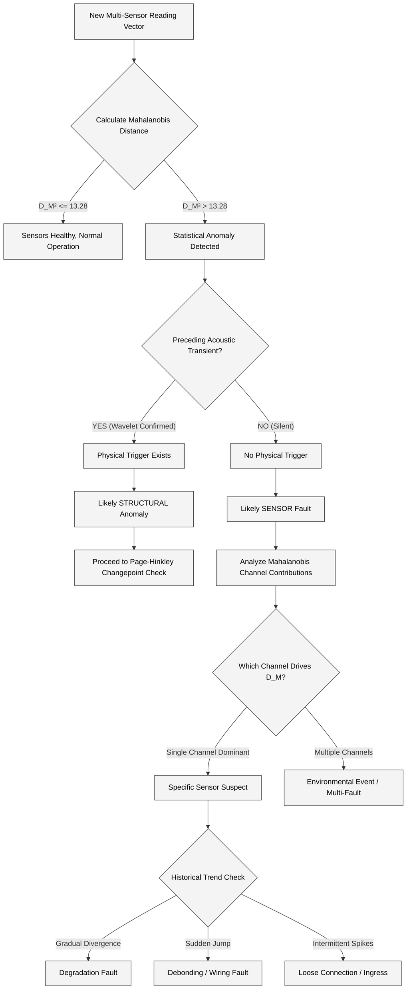

# 11. Sensor Fault Diagnostics

## 1. The Problem: Why Sensor Faults Matter

In long-term structural health monitoring (SHM) of concrete highway bridges, the sensors themselves are often exposed to harsh environmental conditions—extreme heat, monsoon moisture, and relentless vibration from heavy traffic. Over time, these conditions inevitably degrade the sensor hardware or its bonding to the structure.

A degrading sensor can produce anomalous readings that are virtually indistinguishable from genuine structural damage. For example, a debonding strain gauge will show a baseline shift identical to physical yielding. 

This presents three critical risks:
1. **False Alarms:** A malfunctioning sensor triggering a structural alert wastes engineering resources, prompts unnecessary inspections, and erodes trust in the automated system.
2. **False Confidence:** If an alert is assumed to be a sensor fault but is actually structural damage, catastrophic failure may follow. Conversely, a dead sensor might miss an actual fracture event.
3. **Maintenance Blindness:** Without self-diagnostics, operators must rely on blind, schedule-based maintenance, driving up operational costs.

Most existing low-cost SHM systems fail to address this, treating every anomalous reading as a potential structural event. The ATF V-2.1 architecture implements a robust, continuous self-diagnostic layer—treating sensor health as equally important to structural health. This is a core innovation of the edge-processed system.

---

## 2. Fault Mode Catalog

The table below details the known physical failure modes for the V-2.1 node's sensory array and how the continuous anomaly detection system identifies them.

| Sensor | Fault Mode | Physical Cause | Signal Signature | How Mahalanobis Catches It |
|--------|-----------|----------------|------------------|---------------------------|
| **Strain Gauge** | Debonding | Adhesive degradation from moisture/UV or cyclic fatigue | Sudden baseline shift or increased noise, with no corresponding acoustic/tilt activity | Strain channel diverges from acoustic/tilt correlation (covariances break down) |
| **Strain Gauge** | Corrosion | Moisture ingress corroding the foil traces | Gradual drift over weeks/months, increasing noise floor | Slow divergence from historical mean outside normal thermal boundaries |
| **Strain Gauge** | Lead wire damage | Mechanical stress or pest damage on wiring | Intermittent wild spikes, dropouts, or rail-to-rail saturation | Spike pattern completely uncorrelated with any other channel's variance |
| **Piezo Sensor** | Bond degradation | Epoxy aging, thermal cycling fatigue | Reduced sensitivity (systematically lower amplitude events) | Acoustic energy is systematically lower than expected for known load/strain events |
| **Piezo Sensor** | Complete debonding | Mechanical failure of the mounting bracket/epoxy | Near-zero acoustic readings, flatline | Acoustic channel goes flat while strain/tilt remain active during traffic loading |
| **Piezo Sensor** | Water ingress | Enclosure or seal failure allowing moisture to the piezo element | Noisy, erratic high-frequency spurious readings | Acoustic noise pattern is uncorrelated with structural events (strain/tilt) |
| **IMU (MPU6050)** | Bias drift | MEMS aging, uncompensated temperature sensitivity | Slow tilt reading change over time with no real structural movement | Tilt channel drifts while strain/acoustic remain strictly stable |
| **IMU (BNO085)** | Calibration loss | Power cycling glitches, strong magnetic interference | Sudden discrete step offset in tilt | Step change in tilt uncorrelated with strain/temperature channels |
| **BME280** | Ventilation blockage | Debris, dirt accumulation, insect nesting | Temperature reads lag reality or plateau artificially | Temperature no longer correlates with the structure's strain thermal response |
| **BME280** | Sensor degradation | Age, extended high-moisture exposure | Temperature readings gradually diverge from expected local range | Temperature outlier breaks the established 4-variable covariance structure |

---

## 3. Mahalanobis Distance Detection Method

To distinguish between a localized sensor fault and a global structural event, the system leverages multivariate statistics, specifically the Mahalanobis Distance. (For deeper mathematical detail, see [Mathematical Foundations](./08_Mathematical_Foundations.md)).

At any given polling interval, the node forms a multi-dimensional state vector from its channels:
$$ \mathbf{x} = [\text{acoustic\_energy}, \text{strain}, \text{tilt}, \text{temperature}]^T $$

The Mahalanobis distance ($D_M$) measures how far this vector $\mathbf{x}$ is from the historical "normal" joint distribution of the sensors, taking into account the variance and covariance of all channels:
$$ D_M = \sqrt{(\mathbf{x} - \boldsymbol{\mu})^T \Sigma^{-1} (\mathbf{x} - \boldsymbol{\mu})} $$

Where:
* $\boldsymbol{\mu}$ is the vector of historical means for each channel.
* $\Sigma^{-1}$ is the inverse of the covariance matrix, capturing how the channels normally vary together (e.g., how strain normally correlates with temperature).

**Thresholding:**
For a 4-dimensional normal distribution, the squared Mahalanobis distance ($D_M^2$) follows a Chi-square ($\chi^2$) distribution with 4 degrees of freedom. We define an anomalous reading at the 99% confidence interval:
$$ D_M^2 > \chi^2_{0.99, 4} \approx 13.28 $$
If $D_M^2 > 13.28$, the reading is flagged as statistically anomalous.

**Key Insight:** 
The power of the Mahalanobis distance is that it catches *inter-channel correlation breakdowns*, not just per-channel threshold violations. If temperature drops, strain should drop accordingly. If strain drops while temperature remains high, $D_M$ spikes dramatically because the expected covariance is violated, immediately flagging a potential strain gauge issue even if the raw strain value is technically within its absolute limits.

---

## 4. Decision Logic: Sensor Fault vs. Structural Fault

Once an anomaly is detected, the Core 1 processor executes a decision tree to classify the anomaly as either physical structural damage or an internal sensor fault.

### Steps in the Logic:
1. **Anomaly Flagging:** Is the Mahalanobis distance unusually high?
2. **Causal Correlation:** Was there a preceding, wavelet-confirmed acoustic transient? Real structural events (fractures, settling) generate acoustic emission. If a strain shift occurs without a snap, it is highly likely a sensor debonding issue.
3. **Contribution Analysis:** By computing the partial derivative of $D_M$ with respect to each variable, the system identifies which specific sensor broke the correlation.
4. **Trend Check:** The system looks at a short historical window of the offending channel. A gradual drift points to corrosion or MEMS aging; a sudden jump points to debonding.

---

## 5. Fault Response Actions

When a sensor fault is positively identified, the system takes automated actions based on the severity of the fault, avoiding unnecessary panic while ensuring operators are informed.

| Fault Severity | Criteria | Automated Response |
|---------------|----------|-------------------|
| **Minor Drift** | $D_M^2$ slightly elevated, slow divergence in one channel | Log locally. Include note in next scheduled periodic LoRa status report. |
| **Moderate Degradation** | Consistent anomaly in one channel, signal-to-noise ratio decaying | Send asynchronous LoRa maintenance advisory. Temporarily widen structural confidence intervals to avoid false positive alerts. |
| **Critical Failure** | Channel dead, rail-to-rail oscillation, or complete debond | Send urgent LoRa maintenance alert. Exclude the dead channel from data fusion. Switch node to **Degraded Operation Mode**. |

---

## 6. Degraded Operation Mode

In the event of a Critical Failure, the ATF V-2.1 node is designed to fail gracefully rather than locking up or sending spurious data.

If a single channel (e.g., the Strain Gauge) is flagged as irrevocably faulty:
1. **Channel Exclusion:** The node stops polling or trusting the faulty sensor.
2. **Dimensionality Reduction:** The multi-sensor state vector is reduced from 4D to 3D.
3. **Covariance Rebuild:** The Mahalanobis covariance matrix $\Sigma$ is recalculated as a 3×3 matrix using the remaining healthy sensors. The threshold is adjusted to $\chi^2_{0.99, 3} \approx 11.34$.
4. **Altered Logic:** Structural anomaly confidence is inherently reduced. Alerts may require longer validation windows or multi-node consensus to trigger.
5. **Status Flagging:** Every LoRa packet sent explicitly includes a "Degraded Mode" flag, ensuring the gateway/dashboard accurately reflects the node's compromised state.

---

## 7. Fleet-Level Predictive Maintenance (Scale-Up)

*(Note: This is an architectural advantage that becomes fully realized in Phase 2 scaling, see [Scalability Roadmap](./13_Scalability_Roadmap.md)).*

When scaled to hundreds of nodes, sensor fault diagnostics enable intelligent, predictive maintenance of the SHM network itself:
* **Aggregation:** The gateway aggregates fault advisories from across the bridge network.
* **Pattern Recognition:** Operators can identify if a specific batch of sensors fails prematurely, or if sensors on the sun-facing side of a bridge degrade faster.
* **Dispatch Optimization:** Instead of sending technicians to inspect nodes on a blind 6-month schedule, maintenance crews are dispatched only to nodes reporting Moderate or Critical faults, drastically reducing the OPEX of the SHM system.

---

## 8. Concrete Bridge-Specific Considerations

Deploying sensors on concrete highway bridges in tropical or high-stress environments presents specific challenges that drive these failure modes:

* **Monsoon Moisture:** The porous nature of concrete can trap moisture, accelerating the degradation of strain gauge epoxy and leading to corrosion in lead wires.
* **Thermal Extremes:** Extreme heat (e.g., Indian summers) combined with direct UV exposure heavily stresses the bonding agents used for surface-mounted piezo sensors.
* **Continuous Vibration:** The relentless cyclic loading from heavy truck traffic (HGV) accelerates mechanical fatigue in mounting brackets and solder joints.
* **Maintenance Schedule:** Due to these factors, even with predictive diagnostics, a physical visual inspection of nodes is recommended every 6 months, with a proactive re-application of weatherproofing sealants annually.
