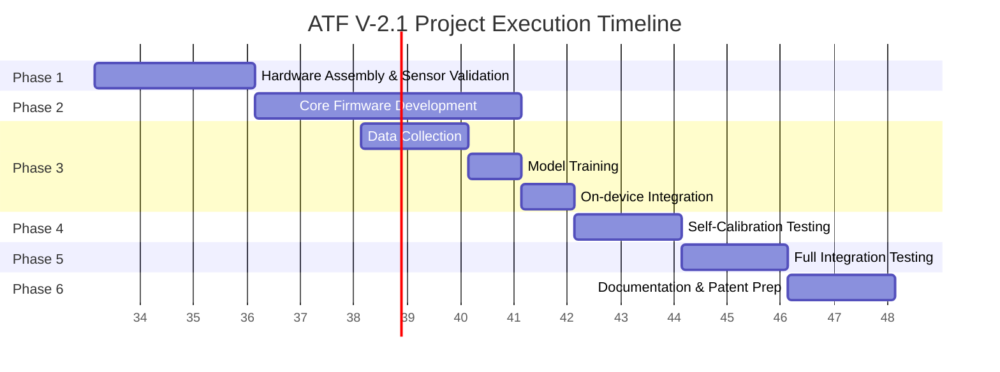

# Project Execution Plan

This document outlines the phased timeline, milestones, deliverables, and dependencies for the ATF V-2.1 Edge-Processed Structural Health Monitoring (SHM) Node project.

## 1. Project Summary

- **Project:** Edge-Processed Structural Health Monitoring Node for Concrete Highway Bridges
- **Objective:** Build and validate a working prototype demonstrating all 6 core innovations.
- **Timeline:** ~16 weeks (4 months)
- **Team Assumption:** 2-3 person team (hardware + firmware/ML)

---

## 2. Execution Phases

### Phase 1: Hardware Assembly & Sensor Validation (Weeks 1-3)
**Objective:** Assemble the hardware prototype and validate each sensor independently.

**Tasks:**
- **Week 1:**
  - [ ] Procure all BOM components (ESP32-S3, HX711 + strain gauge, piezo + LM358, MPU6050, BME280, SX1278, solar panel, 18650 + TP4056)
  - [ ] Assemble breadboard prototype with all components wired
  - [ ] Flash ESP-IDF hello-world to ESP32-S3, verify dual-core operation
  - [ ] Test I2C bus: read BME280 temperature, read MPU6050 tilt
- **Week 2:**
  - [ ] Test HX711: read raw strain values, verify 24-bit ADC noise floor
  - [ ] Test piezo + LM358 comparator: verify interrupt fires on tap/impact
  - [ ] Test SX1278 LoRa: send/receive basic packets between two modules
  - [ ] Test solar charging: verify TP4056 charges 18650 from solar panel
- **Week 3:**
  - [ ] Bond strain gauge to concrete test sample with cyanoacrylate
  - [ ] Bond piezo to concrete test sample
  - [ ] Verify sensor readings change with induced stress (bend concrete, tap surface)
  - [ ] Document baseline sensor characteristics (noise floor, response curves)

**Milestone:** All sensors individually validated, hardware prototype assembled.  
**Deliverable:** Working hardware prototype on breadboard, sensor characterization report.  

### Phase 2: Core Firmware Development (Weeks 3-8)
**Objective:** Implement each subsystem's firmware, one at a time.

**Tasks:**
- **Weeks 3-4: FreeRTOS task infrastructure**
  - [ ] Set up FreeRTOS tasks: sensor_poll (Core 0), event_processor (Core 1)
  - [ ] Implement piezo ISR with FreeRTOS task notification
  - [ ] Implement BME280 + IMU periodic polling on Core 0
  - [ ] Implement shared data structures with mutex protection
- **Weeks 4-5: Acoustic subsystem (Subsystem 1)**
  - [ ] Implement ADC buffer capture on piezo interrupt
  - [ ] Implement Daubechies DWT (db4, 3-level decomposition)
  - [ ] Implement energy thresholding on detail coefficients
  - [ ] Test: verify wavelet correctly detects sharp taps, ignores ambient noise
- **Weeks 5-6: Strain subsystem (Subsystem 2)**
  - [ ] Implement HX711 high-rate reading (80 SPS) during event window
  - [ ] Implement Page-Hinkley changepoint detection
  - [ ] Implement causal correlation logic (acoustic timestamp → strain window)
  - [ ] Test: verify changepoint detects permanent shift, ignores elastic bounce-back
- **Weeks 6-7: Environmental compensation (Subsystem 4)**
  - [ ] Implement paired (temperature, strain) data logging
  - [ ] Implement on-device linear regression
  - [ ] Implement thermal coefficient subtraction
  - [ ] Test: verify compensated strain is stable across temperature changes
- **Weeks 7-8: Sensor health (Subsystem 5) + Tilt (Subsystem 3)**
  - [ ] Implement Mahalanobis distance computation
  - [ ] Implement covariance matrix construction from calibration data
  - [ ] Implement sensor-fault vs structural-fault decision logic
  - [ ] Implement IMU tilt monitoring with drift-rate check
  - [ ] Test: verify Mahalanobis catches simulated sensor degradation

**Milestone:** All core subsystems implemented and individually tested.  
**Deliverable:** Firmware with all 6 subsystems functional.  
**Dependencies:** Phase 1 hardware must be working.  

### Phase 3: TinyML Model Training & Integration (Weeks 6-10)
**Objective:** Train the acoustic classifier and integrate TFLite Micro.

**Tasks:**
- **Weeks 6-8: Data collection**
  - [ ] Record acoustic events: fracture sounds on concrete samples (induced cracks)
  - [ ] Record noise events: traffic simulation, tapping, wind noise
  - [ ] Record strain events: elastic flex, permanent deformation
  - [ ] Label all recordings with ground truth
- **Weeks 8-9: Model training (desktop)**
  - [ ] Extract wavelet features from acoustic recordings
  - [ ] Train small dense NN classifier (fracture vs. noise)
  - [ ] Quantize model to INT8
  - [ ] Convert to TFLite format
  - [ ] Validate accuracy on held-out test set (target >90%)
- **Weeks 9-10: On-device integration**
  - [ ] Integrate TFLite Micro runtime into ESP-IDF firmware
  - [ ] Load model from flash, run inference on Core 1
  - [ ] Verify inference latency (<20ms) and memory usage
  - [ ] End-to-end test: piezo tap → wavelet → classifier → decision

**Milestone:** TinyML model running on-device with real-time inference.  
**Deliverable:** Trained model file, on-device inference pipeline.  
**Dependencies:** Acoustic data from Phase 1 concrete samples.  

### Phase 4: Self-Calibration Testing (Weeks 10-12)
**Objective:** Validate the 14-day self-calibration procedure.

**Tasks:**
- [ ] Deploy node on outdoor concrete surface (or controlled environment with temperature variation)
- [ ] Run 14-day calibration phase, logging all data
- [ ] Verify thermal regression produces R² > 0.80
- [ ] Verify Mahalanobis covariance matrix is well-conditioned
- [ ] Test compensated strain stability across temperature swings
- [ ] Test seasonal recalibration trigger

**Milestone:** Self-calibration validated on real structure.  
**Deliverable:** Calibration validation report with R² values and coefficient analysis.  
**Dependencies:** Phase 2 firmware complete, outdoor test site arranged.  

### Phase 5: Full Integration Testing & Demo Preparation (Weeks 12-14)
**Objective:** Run the complete pipeline end-to-end and prepare demonstration scenarios.

**Tasks:**
- [ ] Full pipeline test: acoustic event → wavelet → changepoint → Mahalanobis → alert
- [ ] Demo scenario (a): induce heat on strain gauge → system correctly ignores (thermal compensation works)
- [ ] Demo scenario (b): tap surface → acoustic trigger → elastic bounce-back → system correctly rejects
- [ ] Demo scenario (c): deliberately degrade strain gauge bond → system flags sensor fault, NOT structural alarm
- [ ] Demo scenario (d): induce simulated fracture (crack concrete sample) → system correctly alerts
- [ ] (Stretch) Demo scenario (e): two-node consensus → single-node false positive suppressed
- [ ] Record video demonstrations of each scenario
- [ ] Prepare presentation materials

**Milestone:** All demo scenarios passing, video recorded.  
**Deliverable:** Demo video, presentation, test results documentation.  

### Phase 6: Documentation & Patent Filing Preparation (Weeks 14-16)
**Objective:** Finalize documentation and prepare patent application.

**Tasks:**
- [ ] Finalize all 17 documentation files (this suite)
- [ ] Prepare patent application with claim language
- [ ] Write technical paper / project report
- [ ] Archive all test data, firmware source, model files
- [ ] Final project review

**Milestone:** Project complete, patent filing ready.  
**Deliverable:** Complete documentation suite, patent draft, project report.  

---

## 3. Gantt Chart

---

## 4. Critical Path

- **Path:** Hardware procurement (Week 1) → Sensor validation → Firmware development → ML training → Calibration testing → Integration testing
- The critical path bottleneck is **Phase 4 (calibration)** because it requires 14 real calendar days minimum to gather environmental variation.
- ML training (Phase 3) can overlap with firmware development (Phase 2).

---

## 5. Risk-Adjusted Timeline

- **Optimistic:** 14 weeks
- **Expected:** 16 weeks
- **Pessimistic:** 20 weeks (if sensor bonding issues occur or calibration needs extension due to lack of natural temperature variation)

---

## 6. Resource Requirements

| Resource | Quantity | Phase(s) |
|----------|----------|----------|
| Team members | 2-3 | All |
| Concrete test samples | 3-5 | Phase 1, 3, 5 |
| Outdoor test site | 1 | Phase 4 |
| Desktop/laptop for ML training | 1 | Phase 3 |
| Video camera for demo recording | 1 | Phase 5 |
